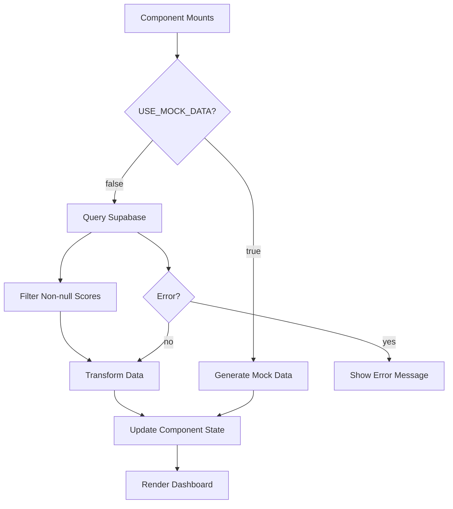

# Supabase Integration Guide

This document explains how the application connects to and queries the Supabase database.

## Overview

The application uses Supabase as its primary database to store and retrieve loan decision data. It connects to the `logs` table to fetch historical loan records for analysis and visualization.

## 1. Supabase Client Setup

### File: `src/lib/supabase.ts`

```typescript
import { createClient } from '@supabase/supabase-js'

const supabaseUrl = import.meta.env.VITE_SUPABASE_URL
const supabaseAnonKey = import.meta.env.VITE_SUPABASE_ANON_KEY

if (!supabaseUrl || !supabaseAnonKey) {
  throw new Error('Missing Supabase environment variables')
}

export const supabase = createClient(supabaseUrl, supabaseAnonKey)
```

**What's happening:**
- Imports the Supabase client library
- Reads environment variables from `.env` file (VITE_SUPABASE_URL and VITE_SUPABASE_ANON_KEY)
- Creates and exports a configured Supabase client instance
- Throws an error if environment variables are missing

## 2. Database Schema

### Logs Table Structure

Based on the provided schema, the `logs` table has the following structure:

```sql
CREATE TABLE logs (
  id bigint PRIMARY KEY,
  created_at timestamp with time zone DEFAULT now(),
  refusal_score double precision,
  refusal_percentile bigint,
  default_score double precision,
  default_percentile bigint,
  organization text,
  decision text,
  info text -- reason for the UW decision
);
```

### TypeScript Interface

```typescript
export interface LoanRecord {
  id: number
  created_at: string
  default_score: number | null
  refusal_score: number | null
  organization: string | null
  decision: string | null
  info: string | null
}
```

**Key Points:**
- Matches the database schema exactly
- Uses `| null` for nullable fields
- Provides type safety for database operations

## 3. Data Fetching Logic

### Main Query (`src/components/Dashboard.tsx`)

```typescript
const { data, error } = await supabase
  .from('logs')                                    // Target the 'logs' table
  .select('id, created_at, default_score, refusal_score, decision')  // Select specific columns
  .not('default_score', 'is', null)               // Filter out null default_score
  .not('refusal_score', 'is', null)               // Filter out null refusal_score
  .order('created_at', { ascending: true });      // Sort by date, oldest first
```

**Query Breakdown:**
- `.from('logs')` - Targets the `logs` table
- `.select(...)` - Only fetches the columns needed for analysis
- `.not('default_score', 'is', null)` - Excludes records where default_score is null
- `.not('refusal_score', 'is', null)` - Excludes records where refusal_score is null
- `.order('created_at', { ascending: true })` - Sorts by creation date (oldest first)

**Why these filters?**
The application requires both `default_score` and `refusal_score` to perform loan decision analysis. Records without these values cannot be processed and are excluded.

## 4. Data Transformation

```typescript
const transformedLoans: LoanData[] = (data || []).map((record: LoanRecord) => ({
  id: record.id.toString(),                    // Convert number to string
  created_at: record.created_at,               // Keep as-is
  default_score: record.default_score || 0,    // Handle potential nulls
  refusal_score: record.refusal_score || 0,    // Handle potential nulls
  historical_decision: record.decision || undefined  // Map to our interface
}));
```

**Transformation Steps:**
1. **ID Conversion**: Database `bigint` → Application `string`
2. **Null Handling**: Provides fallback values for null scores
3. **Field Mapping**: Maps `decision` to `historical_decision` for clarity
4. **Type Safety**: Ensures data matches internal `LoanData` interface

## 5. Error Handling

```typescript
try {
  setLoading(true);
  setError(null);
  
  if (USE_MOCK_DATA) {
    // Use mock data
    const mockLoans = generateMockData();
    setLoans(mockLoans);
    setUsingMockData(true);
  } else {
    // Fetch real data from Supabase
    const { data, error } = await supabase.from('logs')...
    
    if (error) {
      throw error;
    }
    
    setLoans(transformedLoans);
    setUsingMockData(false);
  }
} catch (err) {
  console.error('Error fetching data:', err);
  setError(err instanceof Error ? err.message : 'Failed to fetch loan data');
} finally {
  setLoading(false);
}
```

**Error Handling Features:**
- **Loading States**: Shows loading spinner during data fetch
- **Error Capture**: Catches and displays user-friendly error messages
- **Fallback**: Can switch to mock data if Supabase connection fails
- **State Management**: Properly manages loading/error/success states

## 6. Row Level Security (RLS)

### Current Policies

Based on the schema, the `logs` table has RLS enabled with these policies:

```sql
-- Enable read access for all users
CREATE POLICY "Enable read access for all users" 
ON logs FOR SELECT 
TO public 
USING (true);

-- Enable insert for all users  
CREATE POLICY "Enable insert for all users"
ON logs FOR INSERT
TO public
WITH CHECK (true);
```

**Security Considerations:**
- Uses anonymous key for public read access
- All users can read all loan records
- Consider implementing user-based filtering for production use

## 7. Environment Configuration

### Required Environment Variables

Your `.env` file must include:

```env
VITE_SUPABASE_URL=https://your-project.supabase.co
VITE_SUPABASE_ANON_KEY=your_anonymous_key_here
```

**How to get these values:**
1. Go to your Supabase project dashboard
2. Navigate to Settings → API
3. Copy the Project URL and anon/public key

### Mock Data Toggle

```typescript
// src/config/dataSource.ts
export const USE_MOCK_DATA = false; // Set to true for development
```

**Usage:**
- `false`: Uses real Supabase data
- `true`: Uses generated mock data for development/testing

## 8. Data Flow Summary



## 9. Performance Considerations

### Query Optimization
- **Selective Fields**: Only fetches required columns
- **Filtering**: Excludes incomplete records at database level
- **Ordering**: Sorts data in database rather than client-side

### Potential Improvements
- **Pagination**: For large datasets, implement cursor-based pagination
- **Caching**: Consider caching frequently accessed data
- **Indexes**: Ensure `created_at`, `default_score`, and `refusal_score` are indexed

## 10. Troubleshooting

### Common Issues

**Connection Errors:**
- Verify environment variables are set correctly
- Check Supabase project is active and accessible
- Ensure RLS policies allow public access

**No Data Returned:**
- Check if records exist with non-null `default_score` and `refusal_score`
- Verify date range filters aren't excluding all data
- Check browser console for query errors

**Type Errors:**
- Ensure database schema matches TypeScript interfaces
- Check for null values in required fields
- Verify data transformation logic handles edge cases

### Debug Mode

Enable detailed logging by checking the browser console:
- Query execution logs
- Data transformation steps
- Error messages with stack traces